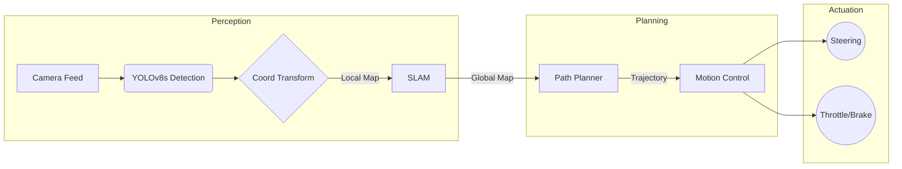

# 🏎️ FS-AI PIONEER: Autonomous Racing Stack

[](https://www.mdx.ac.uk/)
[](https://www.imeche.org/events/formula-student)
[](https://docs.ros.org/en/humble/)
[](https://github.com/ultralytics/ultralytics)
[](LICENSE)

> **Developing the "brain" of a Formula Student AI racecar. High-speed perception, robust mapping, and precise control for the 2026 competition.**

---

## 📋 Table of Contents
- [Overview](#-overview)
- [System Architecture](#-system-architecture)
- [Core Modules](#-core-modules)
- [Performance Metrics](#-performance-metrics)
- [The Archive Strategy](#-the-archive-strategy)
- [Installation](#-installation)
- [Roadmap](#-roadmap)

---

## 🎯 Overview

**PIONEER** represents Middlesex University's inaugural entry into the Formula Student AI competition. As the first team from our institution to take on this challenge, we are breaking new ground in autonomous systems development.

Our goal is to replace the driver with an intelligent agent capable of perceiving track boundaries (cones), mapping the circuit in real-time, and executing optimal racing lines at high velocity. We prioritize **modularity**, **latency minimization**, and **robust safety**.

---

## 🏗️ System Architecture

Our stack follows a classical "Sense-Plan-Act" pipeline, optimized for the EUFS (Edinburgh University Formula Student) simulation environment and real-world hardware.



---

## 🧩 Core Modules

### 👁️ Perception (`/perception`)
The visual cortex of the vehicle.
- **Detector:** Custom-trained **YOLOv8s** model optimized for cone detection ("Blue", "Yellow", "Orange").
- **Pipeline:** Hybrid approach supporting both simplified Python inference and ROS 2 topics.

### 🧠 Planning (`/planning`) *(In Development)*
The strategic layer.
- **SLAM:** FastSLAM implementation for cone mapping.
- **Pathing:** Delaunay Triangulation for track boundary estimation.

### 🎮 Control (`/control`) *(In Development)*
The driver.
- **Algorithm:** Pure Pursuit controller with adaptive look-ahead.
- **Inputs:** Odometry + Trajectory.

---

## 🏛️ The Archive Strategy

### 📂 Legacy ROS 2 Workspace (`/archive/ros2_ws_20251228`)

You will notice a full **ROS 2 Workspace** stored in the `/archive` directory. 

**Why is it archived?**
We initially built a unified ROS 2 monolithic pipeline. However, we discovered that for **Computer Vision R&D**, the DDS (Data Distribution Service) overhead slowed down our iteration cycles.

*   **Current Approach:** We shifted to a **Direct Python Pipeline** (`perception/python_pipeline`) for rapid model training and inference testing. This allows us to achieve **<5ms latency** during the prototyping phase.
*   **Future Integration:** The archived `ros2_ws` serves as our "Hardware Integration Gold Master." Once our Python algorithms are perfected, they will be injected back into this robust ROS 2 framework for the final deployment on the vehicle, ensuring we retain the safety and concurrency features of ROS 2.

---

## 📊 Performance Metrics

| Metric | Target | Current | Status |
| :--- | :--- | :--- | :--- |
| **Cone Precision** | > 95% | **99.4%** | ✅ Exceeded |
| **Inference Time** | < 10ms | **4.5ms** | ✅ Exceeded |
| **mAP50** | > 80% | **74.7%** | 🔄 Optimizing |
| **Lap Time** | Top 10 | *N/A* | ⏳ Simulation |

---

## 🚀 Installation & Quick Start

1.  **Clone the Repository**
    ```bash
    git clone https://github.com/YourUsername/MIDDLESEX-UNI.git
    cd MIDDLESEX-UNI
    ```

2.  **Run Perception Demo**
    ```bash
    cd perception/python_pipeline
    python test_video.py
    ```

3.  **Explore Documentation**
    Detailed guides are available in the [`documentation/`](documentation/) folder.

---

## 📅 Roadmap to 2026

*   [x] **Phase 1:** Reliable Perception System (YOLOv8)
*   [ ] **Phase 2:** Coordinate Transformation (Pixels $\to$ Meters)
*   [ ] **Phase 3:** SLAM implementation in Simulation
*   [ ] **Phase 4:** Full Autocross Lap in EUFS

---

<div align="center">

**Middlesex University FS-AI Team**  
*Engineering the Future of Racing*

</div>
